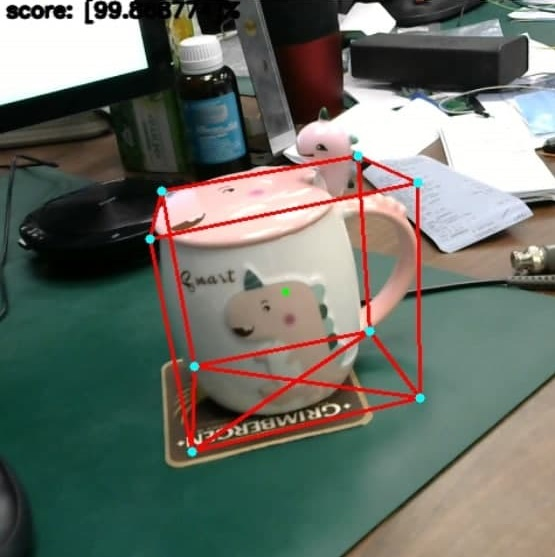

# objectron
This repo contains a solution for using trained [tflite models](https://github.com/google/mediapipe/tree/master/mediapipe/models) (shoes, mags, camera, chair) for 3D detection, trained with [Objectron dataset.](https://github.com/google-research-datasets/Objectron/)
These models output 18 numbers - 9 dots, which I draw with OpenCV methods.
- tf_test.py - run model with 1 image.
- webcam.py - run model with webcam.
- record.py - record & save output video.

So, it can be 3D-mag-detector, 3D-shoe-detector.

It's funny. Try it. Enjoy it.

